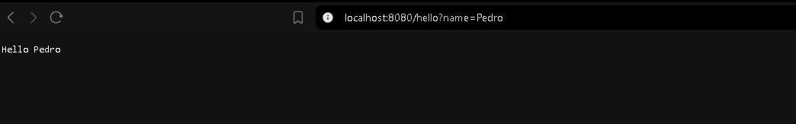
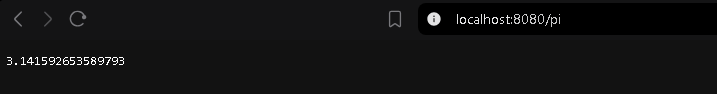
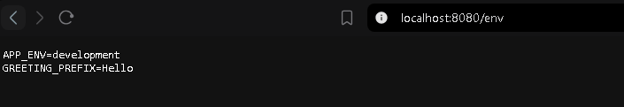
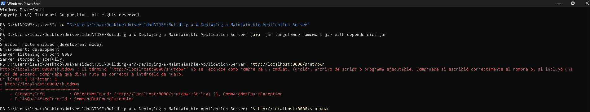
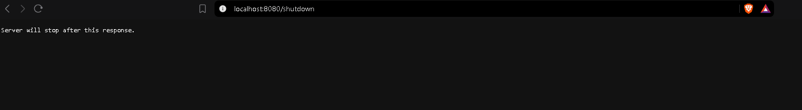
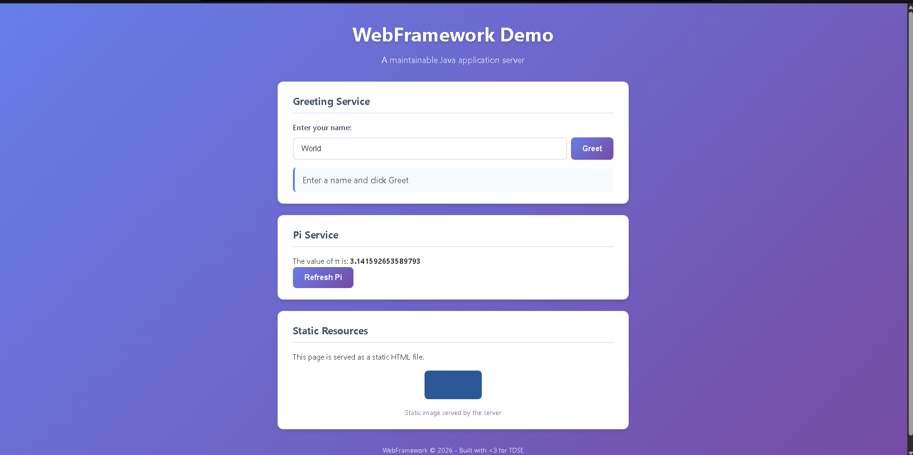

# Building and Deploying a Maintainable Application Server

A small Java web framework (no external dependencies) that serves static files (HTML, CSS, JS, images) and lets developers register HTTP `GET` services with lambdas, plus a demo application built on top of it. The server is **sequential** (one request at a time), configured through **environment variables**, and packaged as a Docker image for cloud deployment.

- **Cloud platform:** [Railway](https://railway.com) (container deployment from the repository's `Dockerfile`)
- **Public URL:** https://maintainable-app-server-production.up.railway.app

## Framework API

```java
import static co.edu.escuelaing.webframework.WebFramework.*;

public class Application {
    public static void main(String[] args) throws Exception {
        staticfiles("/webroot");

        get("/hello", (req, resp) -> {
            String name = req.getValue("name");
            if (name == null || name.isBlank()) name = "world";
            return System.getenv().getOrDefault("GREETING_PREFIX", "Hello") + " " + name;
        });
        get("/pi", (req, resp) -> String.valueOf(Math.PI));

        if (System.getenv().getOrDefault("APP_ENV", "development").equals("development")) {
            get("/shutdown", (req, resp) -> { stop(); return "Server will stop after this response."; });
        }
        start(); // reads PORT (default 8080)
    }
}
```

Adding a route never touches the connection loop.

## Architecture

```
Application                (registers routes + configuration)
    │
WebFramework               (facade: staticfiles(), get(), start(), stop())
    │
HttpServer                 (accept loop, request parsing, response writing)
    ├── Request / Response (HTTP data abstractions)
    ├── Router  ───────────► WebService lambdas  (/hello, /pi, /env, /shutdown)
    └── StaticFileService  (fallback: HTML, CSS, JS, images from /webroot)
```

Request flow: parse method, path and query → look up a dynamic route in the `Router` → if found run its lambda → otherwise ask the `StaticFileService` → otherwise `404 Not Found`.

### Components

| Class | Responsibility |
|---|---|
| `WebFramework` | Public facade; reads `PORT` and `STATIC_FILES_PATH`. |
| `HttpServer` | Sequential accept loop, HTTP parsing/response, error mapping (400/404/405/408/500), graceful stop. |
| `Router` | Maps a path to a `WebService` lambda. |
| `WebService` | Functional interface `String invoke(Request, Response)`. |
| `Request` | Method, path and decoded query parameters (`getValue`). Rejects malformed request lines. |
| `Response` | Status, content type and headers a handler may tweak. |
| `StaticFileService` | Serves text and binary files from the classpath (or an external directory), blocks path traversal, picks the Content-Type. |
| `Application` | Demo app: routes and environment-based configuration. |

### Metaphor: an office building

| Building | Framework |
|---|---|
| Entrance and receptionist (attends one visitor at a time) | `HttpServer` |
| Directory in the lobby | `Router` |
| Individual offices, each with one service | Lambda handlers (`/hello`, `/pi`, `/env`) |
| Document archive | `StaticFileService` (HTML, CSS, JS, images) |
| Building configuration (opening hours, address, rules) | Environment variables (`PORT`, `APP_ENV`, `GREETING_PREFIX`) |
| Malformed visitor / unknown office | 400 / 404 responses, the building keeps operating |
| Closing procedure: finish serving the current visitor, then lock up | Graceful shutdown (`/shutdown`, development only) |

To add a service you add an office and a line in the directory. The reception desk does not change. The master key to close the building (`/shutdown`) is only handed out in development.

## Why this architecture is maintainable

- **Separation of concerns / high cohesion:** sockets and HTTP, routing, static files and business logic live in different classes.
- **Low coupling / extensibility:** new endpoints are registered with `get(path, lambda)`; the server loop is never modified.
- **Abstraction:** developers never touch sockets.
- **Externalized configuration:** port, environment and greeting are environment variables, so the same artifact runs locally and in the cloud.
- **Testability:** `Request`, `Router`, `StaticFileService` and `HttpServer` are tested independently (see [Tests](#tests)).
- **Robustness:** failing handlers give 500, bad requests 400, idle clients time out (5 s) and the server keeps running.

## Build and run locally

Requirements: JDK 17+ and Maven 3.9+.

```bash
mvn clean package                       # compiles and runs the tests
java -jar target/webframework-jar-with-dependencies.jar
# open http://localhost:8080
```

With custom configuration:

```bash
PORT=9090 GREETING_PREFIX=Hola APP_ENV=development java -jar target/webframework-jar-with-dependencies.jar
```

PowerShell: `$env:PORT="9090"; java -jar target\webframework-jar-with-dependencies.jar`

### Docker

```bash
docker build -t webframework .
docker run --rm -p 8080:8080 -e APP_ENV=production -e GREETING_PREFIX=Hola webframework
```

## Environment variables

| Variable | Purpose | Default |
|---|---|---|
| `PORT` | HTTP port (the server binds to all interfaces, not just localhost) | `8080` |
| `APP_ENV` | Execution environment. `/shutdown` exists only when it is `development` | `development` |
| `GREETING_PREFIX` | Prefix used by `/hello` | `Hello` |
| `STATIC_FILES_PATH` | Optional external directory for static files | classpath `/webroot` |

No secrets are stored in the repository.

## Endpoints and examples

| URL | Type | Result |
|---|---|---|
| `/` or `/index.html` | static | Demo page |
| `/styles.css`, `/app.js` | static | CSS and JavaScript |
| `/images/logo.png` | static (binary) | Image |
| `/hello?name=Pedro&language=en` | lambda | `Hello Pedro` |
| `/hello` | lambda | `Hello world` |
| `/pi` | lambda | `3.141592653589793` |
| `/env` | lambda | Shows `APP_ENV` and `GREETING_PREFIX` (non-sensitive) |
| `/shutdown` | lambda (development only) | Stops the server gracefully |
| `/unknown` | - | `404 Not Found` |

The page uses `fetch()` in `app.js` to call `/hello` and `/pi` asynchronously.

## Tests

`mvn test` runs 17 JUnit tests:

- `RequestTest`: query extraction, several parameters, URL decoding, missing parameter, malformed request lines.
- `RouterTest`: registered and unknown routes.
- `StaticFileServiceTest`: HTML, binary PNG, missing file, path traversal (`/../../pom.xml`).
- `HttpServerTest` (real sockets): lambda route, static file, 404 with `text/plain`, 400 and server survives, handler exception gives 500 and server survives, 405, `/shutdown` responds and then stops the server.

### Manual tests (local, `PORT=9090 GREETING_PREFIX=Hola`, development)

```
GET /hello?name=Pedro&language=en  -> 200 "Hola Pedro"
GET /hello                         -> 200 "Hola world"
GET /pi                            -> 200 "3.141592653589793"
GET /env                           -> 200 "APP_ENV=development / GREETING_PREFIX=Hola"
GET /index.html                    -> 200 text/html; charset=utf-8
GET /app.js                        -> 200 application/javascript; charset=utf-8
GET /styles.css                    -> 200 text/css; charset=utf-8
GET /images/logo.png               -> 200 image/png (256 bytes)
GET /unknown                       -> 404 Not Found (text/plain) "404 Not Found"
GET /../pom.xml                    -> 404 Not Found
GARBAGE                            -> 400 Bad Request
GET /hello?name=%zz                -> 400 Bad Request
```

### Local endpoints (browser, development, `localhost:8080`)

| `/hello?name=Pedro` | `/pi` | `/env` |
|---|---|---|
|  |  |  |

`/env` confirms `APP_ENV=development` and the default `GREETING_PREFIX=Hello` when no override is passed.

### `/shutdown` in development

```
$ curl -i localhost:9090/shutdown
HTTP/1.1 200 OK ...
Server will stop after this response.

# server log
Shutdown route enabled (development mode).
Environment: development
Server listening on port 9090
Server stopped gracefully.

$ curl localhost:9090/pi   -> connection refused (server is down)
```

Browser response and the terminal log after calling it:

| Browser: `GET /shutdown` | Terminal: server stops |
|---|---|
|  |  |

The terminal log shows `Shutdown route enabled (development mode)` at startup and `Server stopped gracefully.` right after the request — the connection loop exits only once that response has been fully sent.

### `/shutdown` in production

```
$ PORT=9091 APP_ENV=production java -jar ...
$ curl -i localhost:9091/shutdown
HTTP/1.1 404 Not Found
404 Not Found
$ curl localhost:9091/env
APP_ENV=production
GREETING_PREFIX=Hello
```

The same check against the live Railway deployment (`APP_ENV=production`):

```
$ curl -i https://maintainable-app-server-production.up.railway.app/shutdown
HTTP/1.1 404 Not Found
Content-Type: text/plain; charset=utf-8

404 Not Found
```

`/shutdown` behaves exactly like any unregistered route in production, because `Application.java` only calls `get("/shutdown", ...)` when `APP_ENV` equals `development` — it is never registered, so it can never be reached publicly.

## Cloud deployment

The repository includes a multi-stage `Dockerfile` (Maven build, then a JRE-only image). It is deployed on **Railway**, which builds the image straight from this GitHub repository — same source code, same `Dockerfile`, no cloud-specific changes.

### Reproducing the deployment

Using the Railway CLI (or the equivalent steps in the Railway dashboard):

```bash
railway login
railway init -n maintainable-app-server      # creates the project
railway up                                   # builds the Dockerfile and deploys it
railway variables --set "APP_ENV=production" --set "GREETING_PREFIX=Hola"
railway domain                               # generates the public *.up.railway.app URL
railway domain update <generated-domain> --port 8080   # route traffic to the app's port
```

Railway does **not** need a manually-set `PORT`; the app listens on `8080` (its default when `PORT` is unset — see [`WebFramework.resolvePort`](src/main/java/co/edu/escuelaing/webframework/WebFramework.java)) and the domain is pointed at that same port.

### Cloud evidence

Public URL: **https://maintainable-app-server-production.up.railway.app**

Verified endpoints (production, `APP_ENV=production`, `GREETING_PREFIX=Hola`):

```
GET /                          -> 200  text/html; charset=utf-8          (index.html, static)
GET /images/logo.png           -> 200  image/png, 256 bytes              (binary static resource)
GET /hello?name=Pedro          -> 200  "Hola Pedro"                      (REST endpoint #1)
GET /pi                        -> 200  "3.141592653589793"               (REST endpoint #2)
GET /env                       -> 200  "APP_ENV=production
                                         GREETING_PREFIX=Hola"           (env vars, no secrets)
GET /unknown                   -> 404  "404 Not Found"
GET /shutdown                  -> 404  "404 Not Found"                  (disabled in production)
```

This confirms: static resources are served, both `/hello` and `/pi` work as REST endpoints, the configured environment variables (`APP_ENV`, `GREETING_PREFIX`) are active without exposing secrets, unknown routes return `404`, and `/shutdown` is **not** reachable in the production deployment (it only returns 404, exactly like any other unknown route, because `Application.java` never registers it when `APP_ENV=production`).

Browser evidence of the deployed page (`https://maintainable-app-server-production.up.railway.app/`), rendering the static HTML/CSS and the logo image served by the app:


